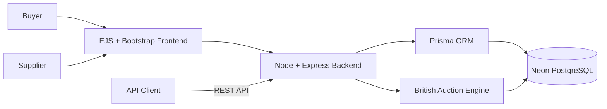
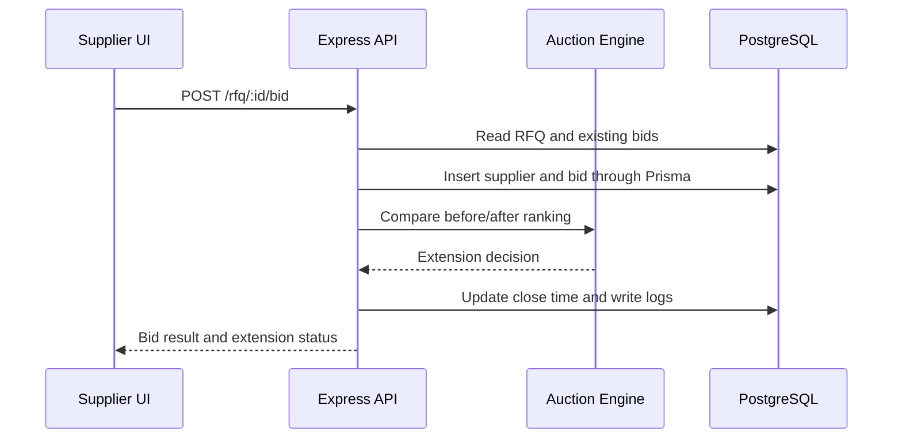

# High Level Design

## Architecture

## Components

- EJS + Bootstrap frontend handles RFQ creation, listing, details, bid submission, rankings, countdown, and logs.
- Express backend exposes REST APIs and owns all validation.
- Prisma ORM manages database access and migrations.
- Auction engine calculates rankings, detects trigger conditions, and caps extensions at forced close.
- Neon PostgreSQL stores RFQs, suppliers, bids, and activity logs.

## API Flow

## Key Rules

- `forced_bid_close_time` must be greater than the original bid close time.
- `current_bid_close_time` must never exceed forced close.
- Rank is based on lowest total quote price.
- Activity logs are the audit trail for bid submissions and time extensions.
