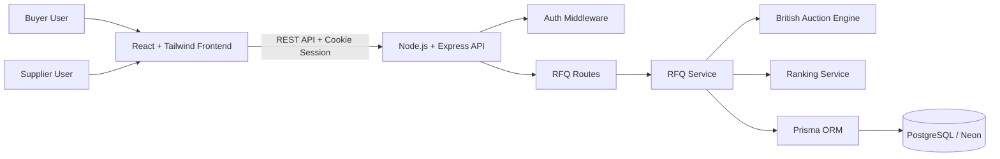
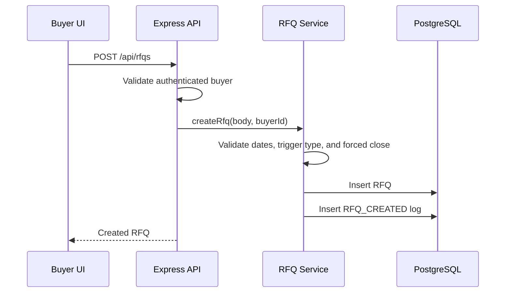
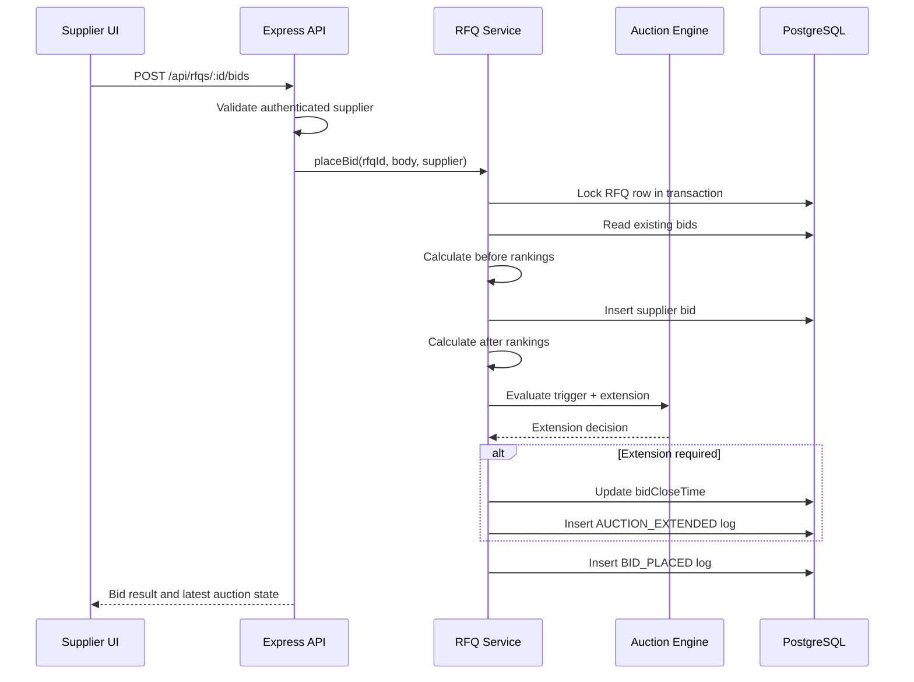
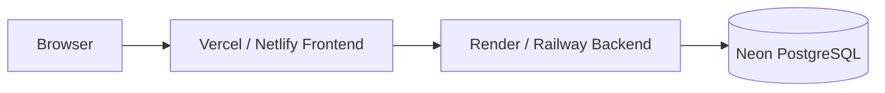

# High Level Design

## Purpose

This document describes the architecture and major runtime flows for the British Auction RFQ System.

Related documents:

- [Submission Document](../SUBMISSION_DOCUMENT.md)
- [Schema Design](./SCHEMA.md)
- [API Reference](./API.md)
- [Demo Guide](./DEMO_GUIDE.md)

## Architecture Diagram

## Component Responsibilities

| Component | Responsibility |
| --- | --- |
| React frontend | Authentication screens, RFQ dashboard, RFQ creation, RFQ detail page, bid form, ranking table, countdowns, and timeline display. |
| Express backend | REST API routing, request validation, authentication enforcement, response shaping, and error handling. |
| Auth middleware | Validates signed JWT cookie and attaches user context to protected RFQ actions. |
| RFQ service | Coordinates RFQ creation, listing, details, bid placement, logs, close checks, and summary metrics. |
| Auction engine | Determines auction status, evaluates extension triggers, and caps close-time extension at forced close. |
| Ranking service | Sorts bids by total quote value and assigns L1, L2, L3 rankings. |
| Prisma ORM | Database access, migrations, schema typing, and transactions. |
| PostgreSQL / Neon | Persistent storage for users, RFQs, suppliers, bids, and auction logs. |

## Request Flow: Create RFQ

## Request Flow: Submit Bid And Extend Auction

## Auction Rules

- Bid close time must be after bid start time.
- Forced close time must be greater than bid close time.
- Auction extension must never exceed forced close time.
- Supplier bids must be lower than the current lowest bid.
- Rankings are ordered by total quote price ascending.
- Ties are ordered by bid creation time.

## British Auction Trigger Types

| Trigger Type | Behavior |
| --- | --- |
| `ANY_BID` | Extends when any valid bid arrives inside the trigger window. |
| `ANY_RANK_CHANGE` | Extends when supplier ranking changes inside the trigger window. |
| `L1_CHANGE` | Extends only when the lowest bidder changes inside the trigger window. |

## UI Refresh Design

Auction listing and detail pages use 10-second polling to refresh:

- RFQ status
- Current close time
- Bids and rankings
- Activity logs
- Countdown-related data

WebSocket refresh is not used on these auction screens.

## Deployment View

