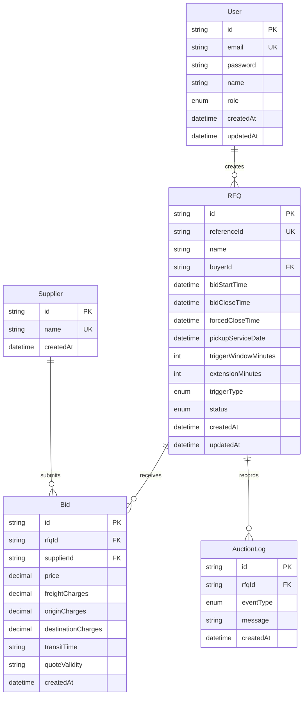

# Schema Design

## Purpose

This document explains the database schema used by the British Auction RFQ System.

Related documents:

- [Submission Document](../SUBMISSION_DOCUMENT.md)
- [High Level Design](./HLD.md)
- [API Reference](./API.md)
- [Demo Guide](./DEMO_GUIDE.md)

The source of truth is [backend/prisma/schema.prisma](../backend/prisma/schema.prisma).

## Entity Relationship Overview



## Tables

### `User`

Stores buyer and supplier accounts.

| Field | Type | Notes |
| --- | --- | --- |
| `id` | String | UUID primary key |
| `email` | String | Unique login email |
| `password` | String | Hashed password |
| `name` | String | Display name |
| `role` | `UserRole` | `ADMIN`, `BUYER`, or `SUPPLIER` |
| `createdAt` | DateTime | Created timestamp |
| `updatedAt` | DateTime | Updated timestamp |

### `RFQ`

Stores RFQ identity, timing, British Auction configuration, and current status.

| Field | Type | Notes |
| --- | --- | --- |
| `id` | String | UUID primary key |
| `referenceId` | String? | Unique RFQ reference |
| `name` | String | RFQ name |
| `buyerId` | String | FK to `User.id` |
| `bidStartTime` | DateTime | Start of bidding window |
| `bidCloseTime` | DateTime | Current close time, may be extended |
| `forcedCloseTime` | DateTime | Hard stop; extension cannot exceed this |
| `pickupServiceDate` | DateTime? | Service/pickup date |
| `triggerWindowMinutes` | Int | X-minute trigger window |
| `extensionMinutes` | Int | Y-minute extension duration |
| `triggerType` | `TriggerType` | Extension trigger |
| `status` | `AuctionStatus` | Auction lifecycle status |
| `createdAt` | DateTime | Created timestamp |
| `updatedAt` | DateTime | Updated timestamp |

### `Supplier`

Stores supplier/carrier names used by bids.

| Field | Type | Notes |
| --- | --- | --- |
| `id` | String | UUID primary key |
| `name` | String | Unique supplier name |
| `createdAt` | DateTime | Created timestamp |

### `Bid`

Stores supplier quote submissions.

| Field | Type | Notes |
| --- | --- | --- |
| `id` | String | UUID primary key |
| `rfqId` | String | FK to `RFQ.id` |
| `supplierId` | String | FK to `Supplier.id` |
| `price` | Decimal | Total quote price |
| `freightCharges` | Decimal | Freight component |
| `originCharges` | Decimal | Origin component |
| `destinationCharges` | Decimal | Destination component |
| `transitTime` | String | Supplier transit time |
| `quoteValidity` | String? | Validity of quote |
| `createdAt` | DateTime | Bid timestamp |

`price` is calculated as:

```text
freightCharges + originCharges + destinationCharges
```

### `AuctionLog`

Stores readable audit trail messages.

| Field | Type | Notes |
| --- | --- | --- |
| `id` | String | UUID primary key |
| `rfqId` | String | FK to `RFQ.id` |
| `eventType` | `LogEventType` | Activity type |
| `message` | String | Human-readable log message |
| `createdAt` | DateTime | Log timestamp |

## Enums

### `TriggerType`

- `ANY_BID`
- `ANY_RANK_CHANGE`
- `L1_CHANGE`

### `AuctionStatus`

- `SCHEDULED`
- `ACTIVE`
- `CLOSED`
- `FORCE_CLOSED`

### `LogEventType`

- `RFQ_CREATED`
- `BID_PLACED`
- `AUCTION_EXTENDED`
- `STATUS_UPDATED`

### `UserRole`

- `ADMIN`
- `BUYER`
- `SUPPLIER`

## Indexes And Constraints

| Model | Index / Constraint | Purpose |
| --- | --- | --- |
| `User` | `email` unique + indexed | Fast login lookup |
| `RFQ` | `referenceId` unique | Prevent duplicate RFQ references |
| `RFQ` | `status` index | Fast listing by status |
| `RFQ` | `bidCloseTime` index | Close-time sorting/checks |
| `RFQ` | `buyerId` index | Buyer ownership lookup |
| `Supplier` | `name` unique | Reuse supplier identity |
| `Bid` | `(rfqId, price, createdAt)` index | Ranking query support |
| `AuctionLog` | `(rfqId, createdAt)` index | Timeline query support |

## Validation Rules

- RFQ reference ID is required.
- RFQ name is required.
- Bid start time must be before bid close time.
- Forced close time must be greater than bid close time.
- Trigger window and extension duration must be positive whole numbers.
- Supplier bid charge fields must be non-negative numbers.
- Supplier bid must be lower than the current lowest bid.
- Extension must never move `bidCloseTime` beyond `forcedCloseTime`.
