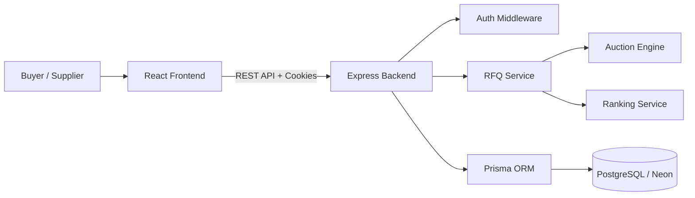

# British Auction RFQ System - Submission Document

## 1. Project Summary

This project implements a simplified RFQ system with British Auction style bidding. Buyers can create RFQs, suppliers can submit competitive quotes, rankings update by lowest total quote price, and the auction can extend automatically when configured bidding activity happens near the close time.

The system is built as a PERN-style application:

- Frontend: React, Vite, Tailwind CSS
- Backend: Node.js, Express
- Database: PostgreSQL / Neon
- ORM: Prisma
- Auth: Cookie-based JWT sessions

## 2. Assignment Requirement Coverage

| Assignment Requirement | Implementation |
| --- | --- |
| RFQ creation with British Auction enabled | Buyer RFQ creation form includes reference ID, name, start time, close time, forced close, pickup/service date, trigger window, extension duration, and trigger type. |
| Forced bid close time | `forcedCloseTime` is stored on RFQ and validated to be greater than `bidCloseTime`. |
| Auction must never extend beyond forced close | Auction engine caps extension at `forcedCloseTime`. Covered by backend tests. |
| Trigger window X minutes | `triggerWindowMinutes` controls when near-close bidding is monitored. |
| Extension duration Y minutes | `extensionMinutes` controls how long the auction is extended. |
| Bid received trigger | Supported as `ANY_BID`. |
| Any supplier rank change trigger | Supported as `ANY_RANK_CHANGE`. |
| Lowest bidder/L1 rank change trigger | Supported as `L1_CHANGE`. |
| Auction listing page | RFQ dashboard shows RFQ name/reference, lowest bid, current close, status, tracked RFQs, bids, and live countdown. |
| Auction detail page | Shows supplier rankings, quote charges, transit time, quote validity, auction configuration, countdown, schedule, and activity timeline. |
| Activity log | Logs RFQ creation, bid submissions, extensions, and status updates with extension reasons. |
| Backend code | Present in `backend/`. |
| Frontend code | Present in `frontend/`. |
| HLD | Present in `docs/HLD.md`. |
| Schema design | Present in `docs/SCHEMA.md` and `backend/prisma/schema.prisma`. |

## 3. High Level Architecture



### Main Components

- React frontend: authentication, RFQ dashboard, create RFQ, RFQ detail, supplier bidding.
- Express API: RFQ routes, auth routes, validation, error handling.
- Auction Engine: status calculation, extension trigger handling, forced close guardrail.
- Ranking Service: sorts supplier bids by total quote and assigns L1, L2, L3.
- Prisma/PostgreSQL: persistent RFQs, bids, suppliers, users, and auction logs.

## 4. Database Schema Overview

Core tables:

- `User`: buyer/supplier accounts.
- `RFQ`: auction configuration, timings, status, buyer ownership.
- `Supplier`: supplier identity used for bids.
- `Bid`: supplier quote components and computed total price.
- `AuctionLog`: audit trail for creation, bids, extensions, and status updates.

Important RFQ fields:

- `referenceId`
- `name`
- `bidStartTime`
- `bidCloseTime`
- `forcedCloseTime`
- `pickupServiceDate`
- `triggerWindowMinutes`
- `extensionMinutes`
- `triggerType`
- `status`

Full schema is available in:

- `docs/SCHEMA.md`
- `backend/prisma/schema.prisma`

## 5. Core Business Logic

### Auction Status

Status is calculated using backend time:

- Before start: `SCHEDULED`
- During bidding window: `ACTIVE`
- After close time: `CLOSED`
- At or after forced close: `FORCE_CLOSED`

### Extension Rules

When a bid is submitted, the backend checks:

1. Is the auction active?
2. Is the bid inside the configured trigger window?
3. Does the bid satisfy the selected trigger type?
4. Would the new close time exceed forced close?

If triggered, the close time is extended by `extensionMinutes`, capped at `forcedCloseTime`.

### Ranking

Bids are ranked by total quote price:

```text
total price = freightCharges + originCharges + destinationCharges
```

Lowest total price becomes `L1`, next lowest becomes `L2`, and so on.

## 6. API Summary

Base RFQ API: `/api/rfqs`

- `POST /api/rfqs`: create RFQ
- `GET /api/rfqs`: list RFQs
- `GET /api/rfqs/:id`: RFQ detail with rankings/logs
- `POST /api/rfqs/:id/bids`: submit supplier bid
- `GET /api/rfqs/:id/logs`: get activity logs
- `POST /api/rfqs/:id/close-check`: update auction close status

Full API documentation is available in `docs/API.md`.

## 7. Frontend UX

The UI is designed as a premium dark SaaS dashboard:

- Left workspace sidebar
- Top navigation with live time
- RFQ dashboard with metrics, live countdown, and auction cards
- RFQ detail control room with countdown, schedule, rules, rankings, bid form, and timeline
- Create RFQ workflow with live configuration panel
- Login/signup split screen with buyer/supplier positioning

RFQ list and RFQ detail pages refresh using 10-second polling. WebSocket refresh is not used for these auction screens.

## 8. Local Setup

### Backend

```bash
cd backend
npm install
cp .env.example .env
npm run deploy:migrate
npm run seed
npm run dev
```

Backend default URL:

```text
http://localhost:5001
```

### Frontend

```bash
cd frontend
npm install
npm run dev
```

Frontend default URL:

```text
http://localhost:5173
```

## 9. Demo Walkthrough

1. Sign up or log in as a buyer.
2. Open `Create RFQ`.
3. Create an RFQ with:
   - Reference ID
   - RFQ name
   - Bid start and close time
   - Forced close time later than bid close time
   - Trigger window
   - Extension duration
   - Trigger type
4. Open RFQ dashboard and confirm the RFQ appears.
5. Log in as a supplier.
6. Open the RFQ detail page.
7. Submit a supplier bid using freight, origin, destination, transit time, and quote validity.
8. Submit a lower bid from another supplier/user to verify ranking changes.
9. For near-close auctions, verify extension logs and updated close time.
10. Use buyer `Run Close Check` to update closed/force-closed status.

## 10. Validation And Testing

Verified commands:

```bash
cd backend
npm test
```

Result:

```text
11 tests passed
```

Coverage includes:

- Active/closed/force-closed status calculation
- Bid ranking
- Any bid extension trigger
- Rank change extension trigger
- L1 change extension trigger
- Extension cap at forced close time
- Auction summary/savings calculation

Frontend production build:

```bash
cd frontend
npm run build
```

Result:

```text
Build passed
```

Note: Vite prints standard `"use client"` warnings from React Router/Lucide during bundling. These are warnings, not build failures.

## 11. Submission Checklist

- Backend code: `backend/`
- Frontend code: `frontend/`
- HLD: `docs/HLD.md`
- Schema design: `docs/SCHEMA.md`
- API documentation: `docs/API.md`
- Demo guide: `docs/DEMO_GUIDE.md`
- Submission document: `docs/SUBMISSION_DOCUMENT.md`
- Prisma schema: `backend/prisma/schema.prisma`
- Tests: `backend/test/auctionEngine.test.js`

## 12. Notes For Evaluator

- The system uses backend-controlled time for auction status and extension decisions.
- Forced close is the final safety limit and cannot be exceeded.
- Activity timeline explains bid submissions and auction extensions.
- Buyer value is visible through lowest price, L1 supplier, total bids, savings, and extension count.
- The UI is intentionally dashboard-oriented to make auction progress, competition, and business value easy to inspect.
